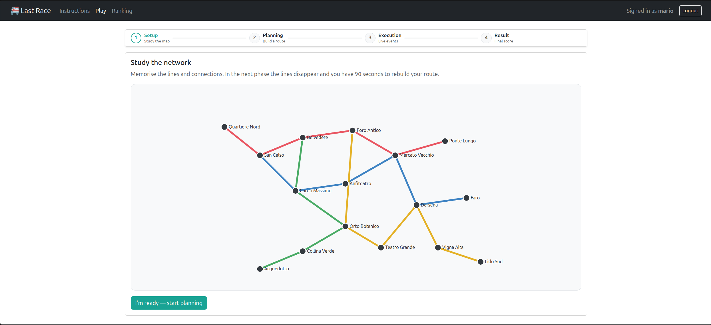
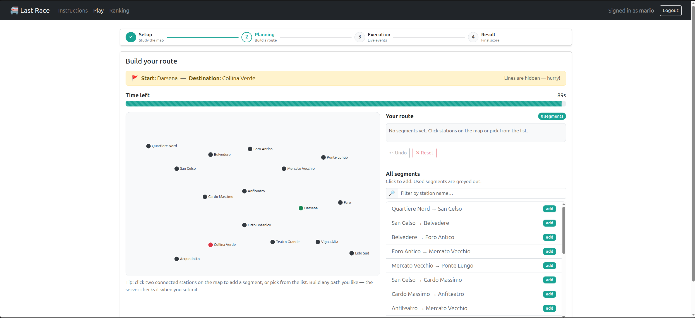
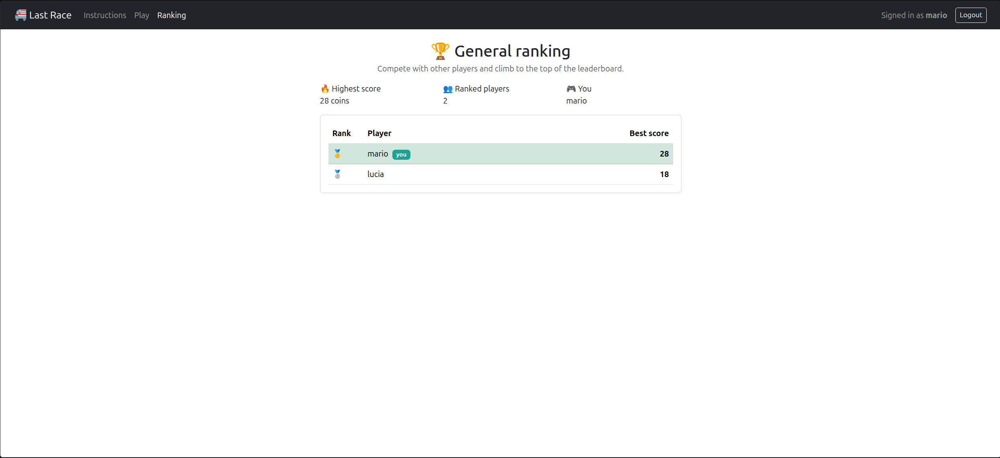

# Exam #1: "Last Race"
## Student: s346278 MOHAMMADI ARIAN

## React Client Application Routes

- Route `/`: instructions page. Public, shown to everyone (anonymous visitors and logged-in users). Explains how to play, the starting balance, and the table of possible events. The network map is not shown to anonymous users.
- Route `/play`: the game page, for logged-in users only. Runs the four game phases (setup, planning, execution, result) as a client-side state machine without reloading.
- Route `/ranking`: the general ranking, for logged-in users only. Lists each registered user's best score, highest first, with summary stat cards.
- Route `/login`: the login form. If the user is already authenticated it redirects to `/play`.
- Any other path redirects to `/`.

## API Server

- POST `/api/sessions`
  - request body: `{ "username": "mario", "password": "password123" }`
  - response body: `{ "id": 1, "username": "mario" }` on success, or `401` with `{ "error": "..." }` on wrong credentials.

- GET `/api/sessions/current`
  - request parameters: none (uses the session cookie).
  - response body: `{ "id": 1, "username": "mario" }` if logged in, or `401` if not.

- DELETE `/api/sessions/current`
  - request parameters: none.
  - response body: `{}` with status `200`. Logs the current user out.

- GET `/api/network` (authenticated)
  - request parameters: none.
  - response body: `{ "stations": [{ "id", "name", "x", "y" }], "lines": [{ "id", "name", "stations": [stationId, ...] }] }`. The full network for the Setup phase.

- GET `/api/network/segments` (authenticated)
  - request parameters: none.
  - response body: `[{ "fromId", "toId", "from", "to" }]`. Connected station pairs without any line information, for the Planning phase.

- GET `/api/events` (public)
  - request parameters: none.
  - response body: `[{ "id", "description", "effect" }]`. All possible events (effect from −4 to +4). Public so the instructions page can show them to anonymous visitors.

- POST `/api/games` (authenticated)
  - request body: none.
  - response body: `{ "gameId", "start": { "id", "name" }, "destination": { "id", "name" }, "startCoins": 20, "planningSeconds": 90, "startedAt" }`. Starts a new game with a random start and destination at least 3 segments apart.

- POST `/api/games/:id/route` (authenticated)
  - request parameters: `:id` is the game id.
  - request body: `{ "route": [1, 2, 3, 11] }` (ordered station ids).
  - response body (valid): `{ "valid": true, "reason": "OK", "score": 23, "steps": [{ "step", "from", "to", "event": { "description", "effect" }, "runningTotal" }] }`.
  - response body (invalid or incomplete): `{ "valid": false, "reason": "...", "score": 0, "steps": [] }`. Execution is skipped and the score is 0.

- GET `/api/ranking` (authenticated)
  - request parameters: none.
  - response body: `[{ "username": "mario", "bestScore": 23 }]`. Each user's best score, highest first.

## Database Tables

- Table `users` - contains the registered users: `id`, `username` (unique), `hash`, `salt` (scrypt password hash and its salt).
- Table `lines` - contains the metro lines: `id`, `name`.
- Table `stations` - contains the stations and their map coordinates: `id`, `name`, `x`, `y`.
- Table `line_stations` - contains which station belongs to which line and in what order: `line_id`, `station_id`, `position`. Adjacency is derived from consecutive positions; a station on more than one line is an interchange.
- Table `events` - contains the possible journey events: `id`, `description`, `effect` (−4 to +4).
- Table `games` - contains one row per game: `id`, `user_id`, `start_id`, `dest_id`, `status` (`planning`/`done`), `score`, `started_at`.
- Table `game_segments` - contains the resolved segments of a finished game with the event applied to each: `id`, `game_id`, `step`, `from_id`, `to_id`, `event_id`.

## Main React Components

- `App` (in `App.jsx`): defines the four routes and the `RequireAuth` guard for logged-in-only pages.
- `NavHeader` (in `NavHeader.jsx`): top navigation bar with the Instructions/Play/Ranking links and login/logout controls.
- `Instructions` (in `Instructions.jsx`): public landing page with the how-to-play steps and the events table fetched from `/api/events`.
- `LoginForm` (in `LoginForm.jsx`): controlled login form with client-side validation.
- `GamePage` (in `GamePage.jsx`): the game state machine; loads the network once and renders the active phase plus the progress stepper and game header.
- `PhaseStepper` (in `PhaseStepper.jsx`): the Setup → Planning → Execution → Result progress indicator.
- `SetupPhase` (in `SetupPhase.jsx`): shows the full network map with lines visible, then a Ready button.
- `PlanningPhase` (in `PlanningPhase.jsx`): the core phase; hides the lines and lets the player build a route by clicking two stations on the map or picking segments from the list, then converts the chosen segments into a station path on submit.
- `NetworkMap` (in `NetworkMap.jsx`): interactive SVG map; draws colored lines in Setup and only clickable stations in Planning.
- `Timer` (in `Timer.jsx`): the 90-second countdown that auto-submits on expiry.
- `SegmentList` (in `SegmentList.jsx`): the freely selectable list of segments, with used ones greyed out.
- `RouteBuilder` (in `RouteBuilder.jsx`): the "Your route" panel with Undo and Reset.
- `ExecutionPhase` (in `ExecutionPhase.jsx`): reveals the server-computed journey one step at a time.
- `ResultPhase` (in `ResultPhase.jsx`): shows the final score, a validity badge, and the journey history.
- `RankingPage` (in `RankingPage.jsx`): the leaderboard with summary stat cards and medals for the top three.

## Screenshot

Setup phase — study the full network map with all lines:

Planning phase — build a route with the lines hidden, by clicking the map or the segment list:

General ranking — each user's best score:

## Users Credentials

- mario, password123 (has played games)
- lucia, metro2026 (has played games)
- paolo, lastrace! (registered, has not played yet)

## Use of AI Tools

I used an AI assistant while working on this project. I used it to clarify concepts (React context, `useRef` for intervals, Passport session handling), to help structure and generate parts of the code (the SVG network map, the route validator, and the UI components), and to debug specific issues such as orienting the submitted route from the assigned start station. I reviewed and tested all generated code myself, adapted it to my own network design and naming, and verified the behavior against the exam specification before including it.